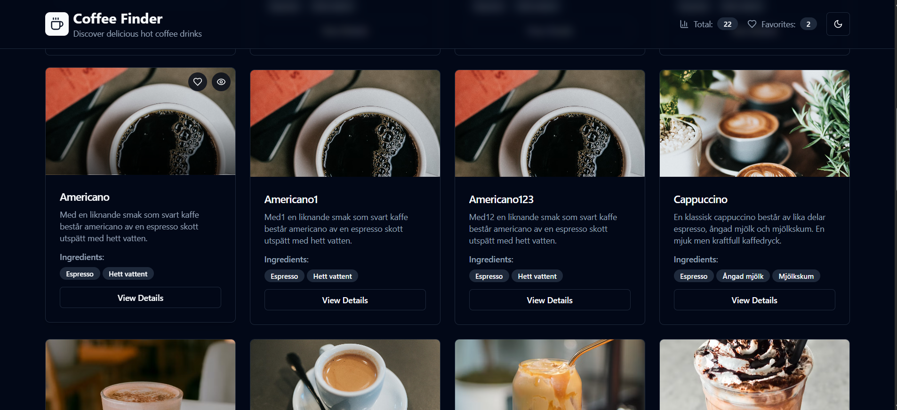

<h1 align="center">☕ Cooffeeistan ☕</h1>

  Welcome to <strong>Cooffeeistan</strong>, a professional and user-friendly website dedicated to coffee enthusiasts! 🌟 
  Explore detailed information about various coffee types, search for your favorite blends, 
  and engage with a vibrant coffee community by liking and sharing your preferences. 🚀

---

---

## ☕ About

  <strong>Cooffeeistan</strong> is a web platform designed to provide comprehensive details about different coffee varieties, their origins, flavors, and brewing methods.  
  Whether you're a casual coffee drinker or a seasoned barista, Cooffeeistan allows you to search for coffees, discover new blends, and interact with the community by liking your favorites. 📚

---

## ✨ Features

- 📝 **Coffee Details**: Access in-depth information about coffee types, including origin, roast profiles, and tasting notes.
- 🔍 **Search Functionality**: Easily search for coffees by name, region, or flavor profile.
- ❤️ **Interactive Likes**: Like and save your favorite coffee blends to your profile.
- 📱 **Responsive Design**: Enjoy a seamless experience across desktops, tablets, and mobile devices.
- 💡 **User-Friendly Interface**: Clean and intuitive UI for effortless navigation.

---

## 🌐 Demo

  <strong>Live Demo:</strong> 
  👉 <a href="#">Check out the live version of CoffeeHub</a> 👈

  <strong>Screenshot:</strong> 
  📸 (Replace this with your actual screenshot) 
  

---
## 🧱 Technologies

The CoffeeHub project is built using the following technologies:

- **Framework**: [Angular 18+](https://angular.io/) 🅰️  
- **Language**: TypeScript  
- **UI Design**: HTML, CSS, [Angular Material](https://material.angular.io/) or custom styles 🎨  
- **HTTP Client**: Angular's built-in `HttpClientModule` for API requests 🌐  
- **API Source**: [SampleAPIs - Coffee (Hot)](https://api.sampleapis.com/coffee/hot) ☕  
- **Component Structure**: Follows Angular best practices with components, services, and modules 📁  
- **State Handling**: Built-in loading and error handling using Angular RxJS and conditional templates 🔄  
- **Development Tools**: Angular CLI, Live Development Server, and Debugging Tools 🛠️
## 🛠️ Installation

To set up CoffeeHub locally, follow these steps:

bash
# Clone the repository 📥
git clone https://github.com/Arihant-jainn/Cooffeeistan.git

# Navigate to the project directory 📂
cd coffeehub

# Install dependencies 🔧
npm install

🚀 Usage
# Run the development server
npm start

Open in browser: http://localhost:3000

# Build for production
npm run build

☕❤️ Enjoy exploring coffees!

🤝 Contributing

Contributions are welcome! Please follow these steps:

# Fork the repository
# Create a new branch
git checkout -b feature/YourFeature

# Commit your changes
git commit -m "Add YourFeature"

# Push to the branch
git push origin feature/YourFeature

# Open a Pull Request

📄 License

This project is licensed under the MIT License – see the LICENSE file for details.

